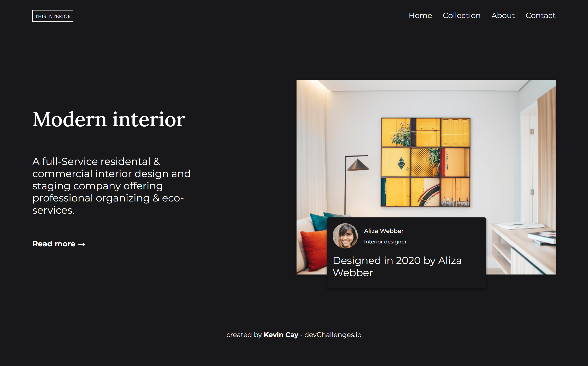

<!-- Please update value in the {}  -->

<h1 align="center">Modern Interior</h1>

   Solution for a challenge from  <a href="http://devchallenges.io" target="_blank">Devchallenges.io</a>.

  <h3>
    <a href="https://www.figma.com/file/3cf83hHRBAGjG5EKPcG2bV/interior-consultant-challenge?node-id=0%3A1">
      Demo
    </a>
     | 
    <a href="https://fervent-northcutt-4f376d.netlify.app/">
      Solution
    </a>
     | 
    <a href="https://devchallenges.io/challenges/Jymh2b2FyebRTUljkNcb">
      Challenge
    </a>
  </h3>

<!-- TABLE OF CONTENTS -->

## Table of Contents

- [Overview](#overview)
  - [Built With](#built-with)

<!-- OVERVIEW -->

## Overview

Introduce your projects by taking a screenshot or a gif. Try to tell visitors a story about your project by answering:

- You can see my demo [here](https://fervent-northcutt-4f376d.netlify.app/) 
- This was a amazing challenge, i improved my responsive skills and re-design using a Figma design.

<!-- This section should list any major frameworks that you built your project using. Here are a few examples.-->

## Features

<!-- List the features of your application or follow the template. Don't share the figma file here :) -->

This application/site was created as a submission to a [DevChallenges](https://devchallenges.io/challenges) challenge. The [challenge](https://devchallenges.io/challenges/Jymh2b2FyebRTUljkNcb) was to build an application to complete the given user stories.

## Contact

- Website [your-website.com](https://{your-web-site-link})
- GitHub [@your-username](https://{Kevin-Cay})
